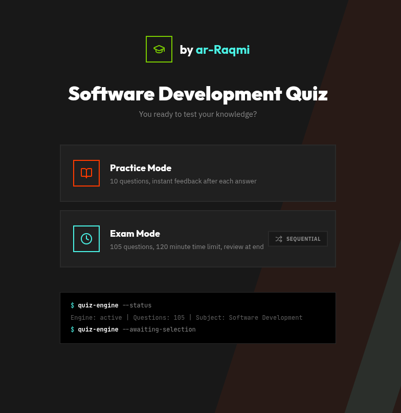
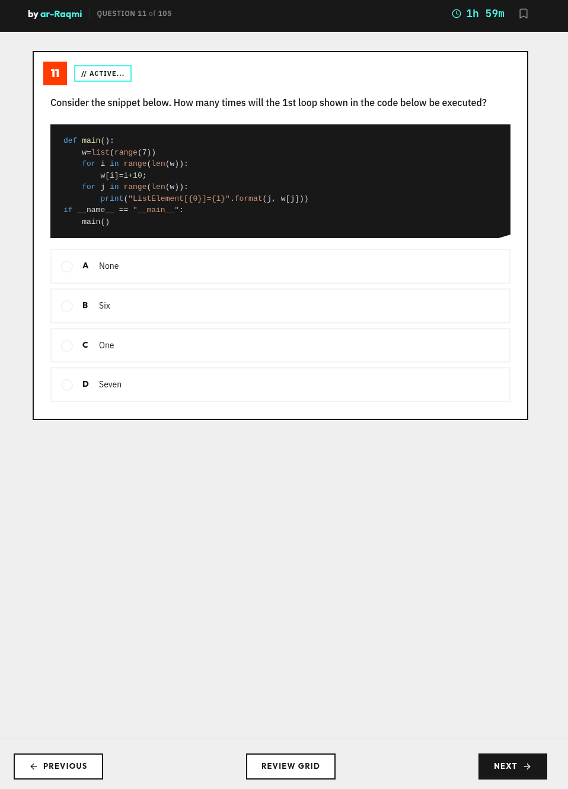
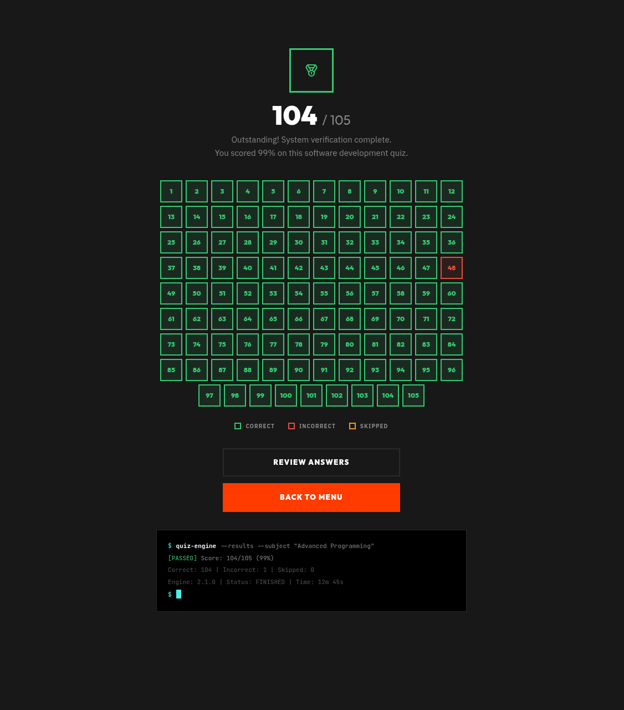

# Software Development Quiz App


A simple quiz app built with Vite + React. Test your knowledge with a clean, straightforward interface.

---

## Screenshots


*The home screen where you start your quiz*


*Answer questions one by one*


*See your score at the end*

---

## Try it out

You can run this app locally, or just use the live version—no install needed.

**Live app:** https://softdev-quiz.vercel.app/

To run locally:
```bash
npm install
npm run dev
```